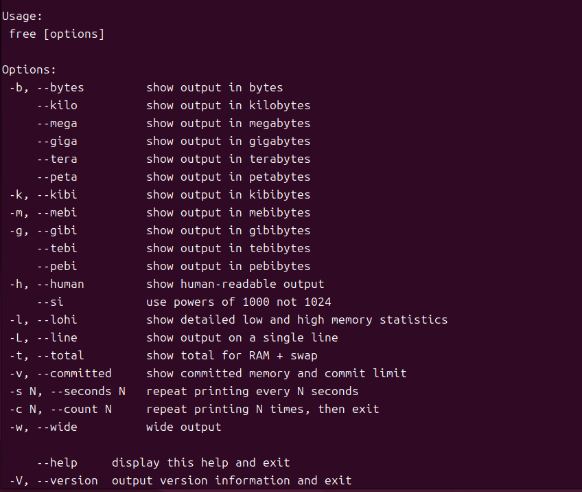
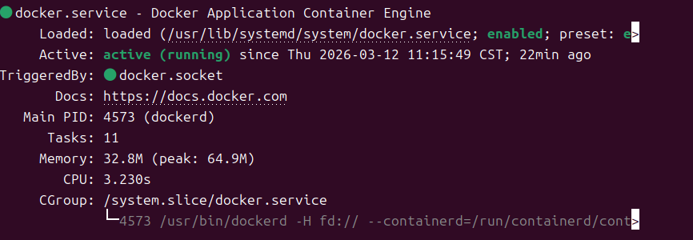
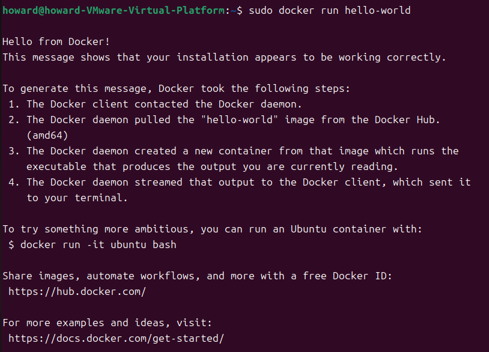

# W01｜虛擬化概論、環境建置與 Snapshot 機制

## 環境資訊
- Host OS：Windows 11 專業版
- VM 名稱：Ubuntu 64-bit
- Ubuntu 版本：Ubuntu 24.04.4 LTS Release:24.0 Codename:noble
- Docker 版本：29.3.0, build 5927d80
- Docker Compose 版本：v5.1.0

## VM 資源配置驗證

| 項目 | VMware 設定值 | VM 內命令 | VM 內輸出 |
|---|---|---|---|
| CPU | 2 vCPU | `lscpu \| grep "^CPU(s)"` | lscpu: bad usage |
| 記憶體 | 4 GB | `free -h \| grep Mem` | free [options] (詳見圖)|
| 磁碟 | 40 GB | `df -h /` | 檔案系統        容量  已用  可用 已用% 掛載點 <br>/dev/sda2        20G   11G  7.7G   59% / |
| Hypervisor | VMware | `lscpu \| grep Hypervisor` | lscpu: bad usage |



## 四層驗收證據
- [ ] ① Repository：`deb [arch=amd64 signed-by=/etc/apt/keyrings/docker.gpg]   https://download.docker.com/linux/ubuntu   noble stable`
- [ ] ② Engine：
```
ii  docker-ce                                      5:29.3.0-1~ubuntu.24.04~noble            amd64        Docker: the open-source application container engine
ii  docker-ce-cli                                  5:29.3.0-1~ubuntu.24.04~noble            amd64        Docker CLI: the open-source application container engine
ii  docker-ce-rootless-extras                      5:29.3.0-1~ubuntu.24.04~noble            amd64        Rootless support for Docker.
```
- [ ] ③ Daemon：`sudo systemctl status docker` 顯示 active

- [ ] ④ 端到端：`sudo docker run hello-world` 成功輸出

- [ ] Compose：`Docker Compose version v5.1.0`

## 容器操作紀錄
- [ ] nginx：
```
howard@howard-VMware-Virtual-Platform:~$ sudo docker run -d -p 8080:80 nginx
5e1bb49346dc952fec4cf7cbee53925219fac37783008ac8da2bc05633b6a753
howard@howard-VMware-Virtual-Platform:~$ curl localhost:8080
<!DOCTYPE html>
<html>
<head>
<title>Welcome to nginx!</title>
<style>
html { color-scheme: light dark; }
body { width: 35em; margin: 0 auto;
font-family: Tahoma, Verdana, Arial, sans-serif; }
</style>
</head>
<body>
<h1>Welcome to nginx!</h1>
<p>If you see this page, nginx is successfully installed and working.
Further configuration is required for the web server, reverse proxy, 
API gateway, load balancer, content cache, or other features.</p>

<p>For online documentation and support please refer to
<a href="https://nginx.org/">nginx.org</a>.<br/>
To engage with the community please visit
<a href="https://community.nginx.org/">community.nginx.org</a>.<br/>
For enterprise grade support, professional services, additional 
security features and capabilities please refer to
<a href="https://f5.com/nginx">f5.com/nginx</a>.</p>

<p><em>Thank you for using nginx.</em></p>
</body>
</html>

```
- [ ] alpine：`sudo docker run -it --rm alpine /bin/sh` 內部命令與輸出

| 指令 | 輸出 |
| --- | --- |
| `hostname` | `07ff009d7dd4` |
| `whoami` | `root` |
| `cat /etc/os-release` | `NAME="Alpine Linux" ID=alpine VERSION_ID=3.23.3 PRETTY_NAME="Alpine Linux v3.23" HOME_URL="https://alpinelinux.org/" BUG_REPORT_URL="https://gitlab.alpinelinux.org/alpine/aports/-/issues"` |
| `ls /` | `bin dev etc home lib media mnt opt proc root run sbin srv sys tmp usr var` |

- [ ] 映像列表：`sudo docker images` 輸出

| IMAGE               | ID            | DISK USAGE | CONTENT SIZE | EXTRA |
|--------------------|---------------|------------|--------------|-------|
| alpine:latest      | 25109184c71b  | 13.1MB     | 3.95MB       |       |
| hello-world:latest | 85404b3c5395  | 25.9kB     | 9.52kB       | U     |
| nginx:latest       | bc45d248c4e1  | 240MB      | 65.8MB       | U     |

## Snapshot 清單

| 名稱 | 建立時機 | 用途說明 | 建立前驗證 |
|---|---|---|---|
| clean-baseline | Ubuntu更新完，Docker還沒裝 | 建立乾淨的系統還原點 | 已驗證 `hostnamectl`、`ip route`、`sudo docker --version`、`docker compose version`、`sudo systemctl status docker --no-pager` 、 `sudo docker run --rm hello-world` |
| docker-ready | Docker裝好並通過四層驗證後 | 確認Docker OK | 已驗證 `sudo systemctl status docker --no-pager`、`sudo docker run --rm hello-world` 、 `sudo docker images` |

## 故障演練三階段對照

| 項目 | 故障前（基線） | 故障中（注入後） | 回復後 |
|---|---|---|---|
| docker.list 存在 | 是 | 否 | 是 |
| apt-cache policy 有候選版本 | 是 | 否 | 是 |
| docker 重裝可行 | 是 | 否 | 是 |
| hello-world 成功 | 是 | N/A | 是 |
| nginx curl 成功 | 是 | N/A | 是 |

## 手動修復 vs Snapshot 回復

| 面向 | 手動修復 | Snapshot 回復 |
|---|---|---|
| 所需時間 | 30多秒 | 2分鐘 |
| 適用情境 | 故障原因單純 | 設定檔被改壞時 |
| 風險 | 手動修復成本上升 | 太多Snapshot會拖慢VMware效能；且實體磁碟損壞Snapshot會遺失 |

## Snapshot 保留策略
- **新增條件：** 每次安裝新工具或大改設定前，且當前狀態已驗證通過時。
- **保留上限：** 最多 3 個活躍 snapshot。
- **刪除條件：** 已有更新節點且舊節點確認不再需要時，刪除最舊的。

## 最小可重現命令鏈
```bash
ls /etc/apt/sources.list.d/
apt-cache policy docker-ce | head -5
sudo systemctl status docker --no-pager
sudo docker run --rm hello-world
sudo docker images
```

## 排錯紀錄
- 症狀：使用Bridge 無法成功連線網路
- 診斷：改為使用NAT測試是否為網路異常，發現是學校網路驗證問題
- 修正：使用學校單一登入
- 驗證：先使用 `ping 8.8.8.8` 測試網路路由，並用 `ping google.com` 檢查DNS是否正常。

## 設計決策
利用VMware作為環境，統一底層作業系統為Ubuntu，消除不同 Host OS 之間的差異，而且出問題時修復容易。
