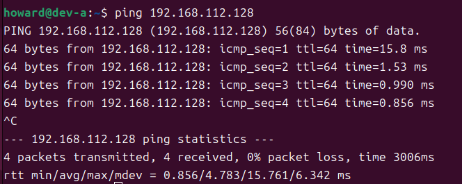
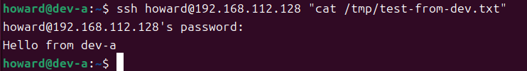
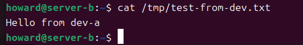

# W02｜VMware 網路模式與雙 VM 排錯

## 網路配置

| VM | 網卡 | 模式 | IP | 用途 |
|---|---|---|---|---|
| dev-a | NIC 1 | NAT | `192.168.201.128/24` | 上網 |
| dev-a | NIC 2 | Host-only | `192.168.112.129/24` | 內網互連 |
| server-b | NIC 1 | Host-only | `192.168.112.128/24` | 內網互連 |

## 連線驗證紀錄

- [ ] dev-a NAT 可上網：`ping google.com` 輸出
```
ping google.com
PING google.com (142.250.66.78) 56(84) bytes of data.
64 bytes from hkg12s27-in-f14.1e100.net (142.250.66.78): icmp_seq=1 ttl=128 time=13.0 ms
64 bytes from hkg12s27-in-f14.1e100.net (142.250.66.78): icmp_seq=2 ttl=128 time=10.9 ms
64 bytes from hkg12s27-in-f14.1e100.net (142.250.66.78): icmp_seq=3 ttl=128 time=22.7 ms
64 bytes from hkg12s27-in-f14.1e100.net (142.250.66.78): icmp_seq=4 ttl=128 time=40.0 ms
64 bytes from hkg12s27-in-f14.1e100.net (142.250.66.78): icmp_seq=5 ttl=128 time=13.4 ms
64 bytes from hkg12s27-in-f14.1e100.net (142.250.66.78): icmp_seq=6 ttl=128 time=6.50 ms
64 bytes from hkg12s27-in-f14.1e100.net (142.250.66.78): icmp_seq=7 ttl=128 time=36.7 ms
64 bytes from hkg12s27-in-f14.1e100.net (142.250.66.78): icmp_seq=8 ttl=128 time=14.1 ms
64 bytes from hkg12s27-in-f14.1e100.net (142.250.66.78): icmp_seq=9 ttl=128 time=10.8 ms
64 bytes from hkg12s27-in-f14.1e100.net (142.250.66.78): icmp_seq=10 ttl=128 time=35.5 ms
64 bytes from hkg12s27-in-f14.1e100.net (142.250.66.78): icmp_seq=11 ttl=128 time=24.3 ms
64 bytes from hkg12s27-in-f14.1e100.net (142.250.66.78): icmp_seq=12 ttl=128 time=16.3 ms
^C
--- google.com ping statistics ---
12 packets transmitted, 12 received, 0% packet loss, time 11023ms
rtt min/avg/max/mdev = 6.500/20.347/40.002/10.950 ms 
```
- [ ] 雙向互 ping 成功：貼上雙方 `ping` 輸出



- [ ] SSH 連線成功：`ssh <user>@<ip> "hostname"` 輸出
    ```
    ## 因為這裡有先做了Week03，所以hostname是app

    ssh howard@192.168.112.128 "hostname"
    howard@192.168.112.128's password: 
    app

    ```
- [ ] SCP 傳檔成功：`cat /tmp/test-from-dev.txt` 在 server-b 上的輸出


- [ ] server-b 不能上網：`ping 8.8.8.8` 失敗輸出

    `ping: connect: 無法接觸網路`

## 故障演練一：介面停用

| 項目 | 故障前 | 故障中 | 回復後 |
|---|---|---|---|
| server-b 介面狀態 | UP | DOWN | UP |
| dev-a ping server-b | 成功 | 失敗 | 成功 |
| dev-a SSH server-b | 成功 | 失敗 | 成功(顯示app) |

## 故障演練二：SSH 服務停止

| 項目 | 故障前 | 故障中 | 回復後 |
|---|---|---|---|
| ss -tlnp grep :22 | 有監聽 | 無監聽 | `LISTEN 0  4096  0.0.0.0:22  0.0.0.0:* ` |
| dev-a ping server-b | 成功 | 成功 | 成功 |
| dev-a SSH server-b | 成功 | Connection refused | 成功(顯示app) |

## 排錯順序
1. **L2**
   - **檢查內容**：有沒有拿到正確的 IP 位址？
   - **使用命令**：`ip address show`

2. **L3**
   - **檢查內容**：在 L2 正常的前提下，確認路由是否正確，以及網路封包能否抵達對端。
   - **使用命令**：先用 `ip route show` 檢查路由，再用 `ping -c 4 IP` 測試。

3. **L4**
   - **檢查內容**：確認SSH是否有啟動並在特定的Port上監聽，且連線未被防火牆阻擋。
   - **使用命令**：目標端使用 `ss -tlnp | grep :22` 確認監聽狀態，來源端使用 `ssh howard@<ip> "hostname"` 實際測試連線。


## 網路拓樸圖
（嵌入或連結 network-diagram.png）

## 排錯紀錄
- 症狀：
- 診斷：（你首先查了什麼？用了哪個命令？）
- 修正：（做了什麼改動？）
- 驗證：（如何確認修正有效？）

## 設計決策
（說明本週至少 1 個技術選擇與取捨，例如：為什麼 server-b 只設 Host-only 不給 NAT？）
