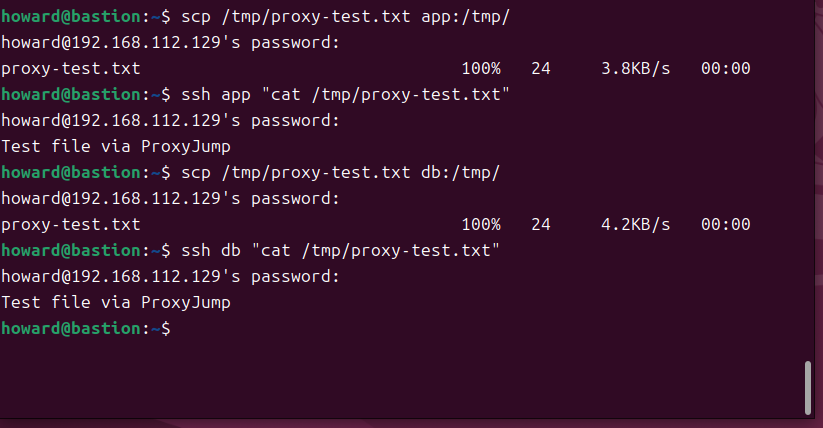
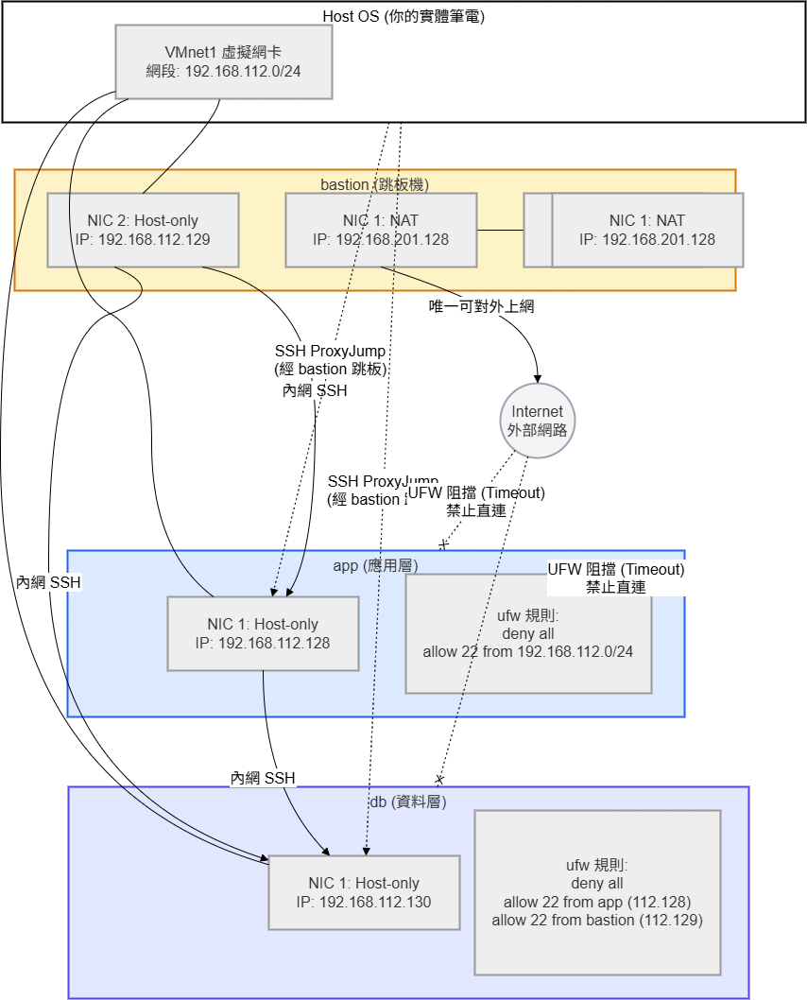

# W03｜多 VM 架構：分層管理與最小暴露設計

## 網路配置

| VM | 角色 | 網卡 | 模式 | IP | 開放埠與來源 |
|---|---|---|---|---|---|
| bastion | 跳板機 | NIC 1 | NAT | `192.168.201.128/24` | SSH from any |
| bastion | 跳板機 | NIC 2 | Host-only | `192.168.112.129/24` | — |
| app | 應用層 | NIC 1 | Host-only | `192.168.112.128/24` | SSH from 192.168.56.0/24 |
| db | 資料層 | NIC 1 | Host-only | `192.168.112.130/24` | SSH from app + bastion |

## SSH 金鑰認證

- 金鑰類型：ed25519
- 公鑰部署到：`~/.ssh/authorized_keys`
- 免密碼登入驗證：
  - bastion → app：`金鑰認證成功`
  - bastion → db：`金鑰認證成功`
  

## 防火牆規則

### app 的 ufw status
```
howard@server-b:~$ sudo ufw status verbose
狀態: 啓用
日誌: on (low)
Default: deny (incoming), allow (outgoing), deny (routed)
新建設定檔案: skip

至                          動作          來自
-                          --          --
22/tcp                     ALLOW IN    192.168.56.0/24           
22/tcp                     ALLOW IN    192.168.112.0/24          
```

### db 的 ufw status

```
howard@server-b:~$ sudo ufw status verbose
狀態: 啓用
日誌: on (low)
Default: deny (incoming), allow (outgoing), deny (routed)
新建設定檔案: skip

至                          動作          來自
-                          --          --
22/tcp                     ALLOW IN    192.168.112.128           
22/tcp                     ALLOW IN    192.168.112.129           
```

### 防火牆確實在擋的證據
```
howard@dev-a:~$ curl -m 5 http://<app-host-only-ip>:8080 2>&1
bash: app-host-only-ip: 沒有此一檔案或目錄
```


## ProxyJump 跳板連線
- 指令：`ssh -J howard@192.168.112.129 howard@192.168.112.128 "hostname"`
- 驗證輸出：
    ```
    howard@dev-a:~$ ssh -J howard@192.168.112.129 howard@192.168.112.128 "hostname"
    howard@192.168.112.129's password: 
    app
    ```

- SCP 傳檔驗證：`Test file via ProxyJump`
 

## 故障場景一：防火牆全封鎖

| 項目 | 故障前 | 故障中 | 回復後 |
|---|---|---|---|
| app ufw status | active + rules | deny all | active + rules |
| bastion ping app | 成功 | 成功 | 成功 |
| bastion SSH app | 成功 | **timed out** | 成功 |

## 故障場景二：SSH 服務停止

| 項目 | 故障前 | 故障中 | 回復後 |
|---|---|---|---|
| ss -tlnp grep :22 | 有監聽 | 無監聽 | 有監聽 |
| bastion ping app | 成功 | 成功 | 成功 |
| bastion SSH app | 成功 | **refused** | 成功 |

## timeout vs refused 差異

這兩種錯誤訊息代表了網路連線在不同層級遭遇了阻礙，排錯的方向也完全不同：

* **Connection timed out（連線逾時）：**
  代表packets被防火牆丟棄。因為伺服器直接把封包丟掉而不做任何回應，客戶端只能一直等，直到時間到了才顯示 timeout。

* **Connection refused（連線被拒絕）：**
  這代表網路層是通的，但該埠口沒有服務在監聽，所以系統拒絕連線。
## 網路拓樸圖
 

## 排錯紀錄
- 症狀：在進行跳板連線時，host-only-ip報錯，顯示`keyword hostname extra arguments at end of line`
- 診斷：查看報錯與檢查指令是否正確
- 修正：重新輸入指令(重複輸入會導致設定檔壞掉，有先用rm刪除)
```
mkdir -p ~/.ssh
cat >> ~/.ssh/config << 'EOF'
Host bastion
    HostName 192.168.112.129
    User howard

Host app
    HostName 192.168.112.128
    User howard
    ProxyJump bastion

Host db
    HostName 192.168.112.130
    User howard
    ProxyJump bastion
EOF

chmod 600 ~/.ssh/config
```
- 驗證：再試 ProxyJump `scp /tmp/proxy-test.txt app:/tmp/ ssh app "cat /tmp/proxy-test.txt"` 
## 設計決策

**決策點：為什麼 db（資料層）的防火牆除了允許 app 連線外，還要特別允許 bastion 直連？**

在本週的分層架構中，我們實踐了「最小暴露原則」，將對外唯一的 SSH 入口限制在 bastion（跳板機）上。按照最嚴格的邏輯，db 似乎只需允許 app 存取即可。
果今天 app 機器因為某些原因當機或毀損，且 db 防火牆只允許 app 進入，那麼系統管理員將完全失去進入 db 進行修復或備份的管道。因此，允許 bastion 直連 db，不僅維持了不對公網暴露的安全性，同時也確保了維護通道的獨立與暢通。
