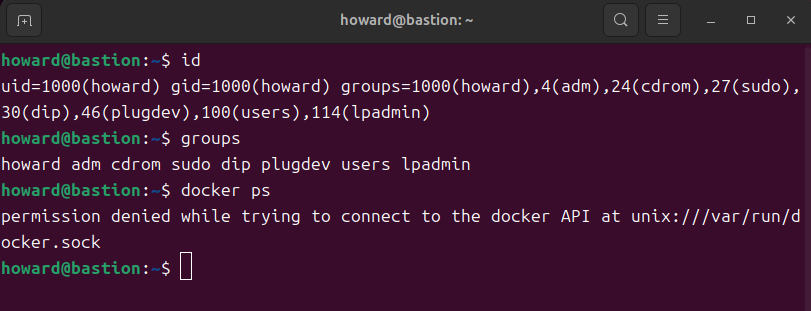

# W04｜Linux 系統基礎：檔案系統、權限、程序與服務管理

## FHS 路徑表

| FHS 路徑 | FHS 定義 | Docker 用途 |
|---|---|---|
| /etc/docker/ | 系統級設定檔 | `daemon.json`（Docker daemon 設定） |
| /var/lib/docker/ | 程式的持久性狀態資料 | 存放映像 (images)、容器 (containers)、volumes |
| /usr/bin/docker | 使用者可執行檔 | Docker CLI 工具程式 |
| /run/docker.sock | 執行期暫存（PID/socket） | Docker daemon 的 Unix socket |

## Docker 系統資訊

- Storage Driver：overlayfs
- Docker Root Dir：/var/lib/docker
- 拉取映像前 /var/lib/docker/ 大小：`316K	/var/lib/docker/`
- 拉取映像後 /var/lib/docker/ 大小：`320K	/var/lib/docker/`

## 權限結構

### Docker Socket 權限解讀
- 輸出結果：`權限：(0660/srw-rw----)    Uid：(    0/    root)  Gid：(  984/  docker)`
- 權限解讀：權限為 `srw-rw----`。 owner (root) 具有讀寫權限；group (docker) 具有讀寫權限；others (其他人) 完全沒有任何存取權限。

### 使用者群組
- 輸出結果：包含docker群組
```
howard@bastion:~$ id
uid=1000(howard) gid=1000(howard) groups=1000(howard),4(adm),24(cdrom),27(sudo),30(dip),46(plugdev),100(users),114(lpadmin),984(docker)
```

### 安全意涵
因為 Docker daemon 是以 root 權限在系統背景運行的，如果將使用者加入 `docker` 群組，該使用者就能無障礙地透過 docker.sock 指揮 daemon。這等同於擁有了 root 權限，因為使用者可以透過掛載 Host 系統目錄（例如 `/etc/shadow`）到容器內來讀取或修改主機的任意敏感檔案。

## 程序與服務管理

### systemctl status docker
```
systemctl status docker
Warning: The unit file, source configuration file or drop-ins of docker.service>
● docker.service - Docker Application Container Engine
     Loaded: loaded (/usr/lib/systemd/system/docker.service; enabled; preset: e>
     Active: active (running) since Sat 2026-03-21 12:38:21 CST; 4 weeks 2 days>
TriggeredBy: ● docker.socket
       Docs: https://docs.docker.com
   Main PID: 1649 (dockerd)
      Tasks: 10
     Memory: 135.5M (peak: 159.3M)
        CPU: 22.410s
     CGroup: /system.slice/docker.service
             └─1649 /usr/bin/dockerd -H fd:// --containerd=/run/containerd/cont>

 3月 21 12:38:20 dev-a dockerd[1649]: time="2026-03-21T12:38:20.678251800+08:00>
 3月 21 12:38:21 dev-a dockerd[1649]: time="2026-03-21T12:38:21.870148300+08:00>
 3月 21 12:38:21 dev-a dockerd[1649]: time="2026-03-21T12:38:21.870958116+08:00>
 3月 21 12:38:21 dev-a dockerd[1649]: time="2026-03-21T12:38:21.906611677+08:00>
 3月 21 12:38:21 dev-a dockerd[1649]: time="2026-03-21T12:38:21.907533298+08:00>
 3月 21 12:38:21 dev-a dockerd[1649]: time="2026-03-21T12:38:21.949776305+08:00>
 3月 21 12:38:21 dev-a dockerd[1649]: time="2026-03-21T12:38:21.960785509+08:00>
 3月 21 12:38:21 dev-a dockerd[1649]: time="2026-03-21T12:38:21.961183250+08:00>
 3月 21 12:38:21 dev-a systemd[1]: Started docker.service - Docker Application >
 4月 20 14:36:54 bastion dockerd[1649]: time="2026-04-20T14:36:54.333257689+08:>
lines 1-23
```


### journalctl 日誌分析
**事件說明：**
  這行日誌顯示 Docker daemon（`dockerd`，PID 為 1649）在背景成功執行了一項任務。日誌級別為 `info`（一般資訊），具體事件是 `msg="image pulled"`，也就是成功從外部的 Docker Hub 下載了 `nginx:latest` 的映像檔。
``` 
4月 20 14:36:54 bastion dockerd[1649]: time="2026-04-20T14:36:54.333257689+08:00" level=info msg="image pulled" digest="sha256:7f0adca1fc6c29c8dc49a2e90037a10ba20dc266baaed0988e9fb4d0d8b85ba0" remote="docker.io/library/nginx:latest"
```

### CLI vs Daemon 差異
Docker CLI（`/usr/bin/docker`）只是使用者呼叫的命令列工具，而 Daemon（`dockerd`）是實際在背景執行的系統服務。`docker --version` 能夠成功，只是因為 CLI 程式本身存在並印出了自己的版本，這不依賴 Daemon；但如果要做任何實質操作（如 `docker ps`），就必須透過 socket 聯絡 Daemon 才能完成。

## 環境變數

- $PATH：`  /usr/local/sbin:/usr/local/bin:/usr/sbin:/usr/bin:/sbin:/bin:/usr/games:/usr/local/games:/snap/bin:/snap/bin`
- which docker：`/usr/bin/docker`
- 容器內外環境變數差異觀察：容器是一個隔離的執行環境，不會繼承 Host OS 的 shell 設定，因此容器內的 `$HOME` 與 `$PATH` 變數都與 Host 完全不同。

## 故障場景一：停止 Docker Daemon

| 項目 | 故障前 | 故障中 | 回復後 |
|---|---|---|---|
| systemctl status docker | active | inactive (dead) | active |
| docker --version | 正常 | 正常 | 正常 |
| docker ps | 正常 | Cannot connect | 正常 |
| ps aux grep dockerd | 有 process | 無 process | 有 process |

## 故障場景二：破壞 Socket 權限

| 項目 | 故障前 | 故障中 | 回復後 |
|---|---|---|---|
| ls -la docker.sock 權限 | srw-rw---- | srw------- | srw-rw---- |
| docker ps（不加 sudo） | 正常 | permission denied | 正常 |
| sudo docker ps | 正常 | 正常 | 正常 |
| systemctl status docker | active | active | active |

## 錯誤訊息比較

| 錯誤訊息 | 根因 | 診斷方向 |
|---|---|---|
| Cannot connect to the Docker daemon | daemon 沒在跑 | 檢查 `systemctl status docker` 來確認服務狀態並重新啟動 daemon |
| permission denied…docker.sock | daemon 在跑，但使用者無權存取 socket | 檢查 `ls -la /var/run/docker.sock` 以及自身 `id`，確認權限與群組設定 |

兩種錯誤的差異在於目標狀態不同：`Cannot connect` 代表目標服務「不存在或未啟動」；而 `permission denied` 代表目標服務「活著，但拒絕你的存取」。

## 排錯紀錄
- **症狀：** 執行 `usermod -aG docker $USER` 將自己加入群組後，執行 `docker ps` 依然顯示 `permission denied`。

- **診斷：** 檢查 `groups` 發現當前 session 中依然沒有 docker 群組。
- **修正：** 執行 `exit` 登出，並重新 SSH 連線登入 bastion 機器，讓新的群組設定生效。
- **驗證：** 重新執行 `docker ps`，成功回傳容器列表，不需要再加 `sudo`。

## 設計決策
**為什麼教學環境用 `usermod` 加 group 而不是每次 sudo？**
為了方便後續頻繁操作 Docker 指令，避免每次都要輸入密碼，提升實驗效率。
**這個選擇的風險是什麼？**
把使用者加入 docker group 等同於賦予該使用者 root 等級的權力。若在生產環境中這樣做，任何擁有該帳號權限的人，都可以輕易地透過掛載敏感目錄的方式修改主機系統（如密碼檔 `/etc/shadow`），帶來極大的安全風險。