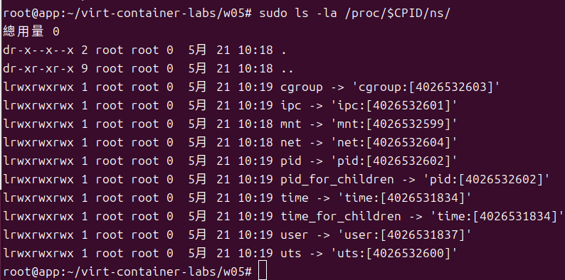

# W05｜把容器拆開來看：Namespace / Cgroups / Union FS / OCI

## Docker 環境

Storage Driver: overlayfs
Cgroup Driver: systemd
Cgroup Version: 2
Runtimes: io.containerd.runc.v2 runc
Default Runtime: runc


## Namespace 觀察

### 六種 namespace 用途
- **PID**：隔離 Process ID 視角。容器內的 process 會以為自己是 PID 1，但從 host 來看它只是一個擁有大數字 PID 的普通 process。
- **NET**：隔離網路堆疊。容器擁有專屬的虛擬網卡（如 eth0, lo）、IP 位址與獨立的 iptables 規則。
- **MNT**：隔離檔案系統掛載點。讓容器擁有自己獨立的根目錄 `/`，無法直接窺探或修改 host 的檔案系統。
- **UTS**：隔離主機名稱與網域名稱。讓容器可以設定專屬的 hostname，而不影響 host 主機。
- **IPC**：隔離行程間通訊。確保不同容器間的共享記憶體或 message queue 不會互相干擾。
- **USER**：隔離使用者與群組 ID 映射。允許容器內的 root 使用者在 host 實際上對應為一個無特權的普通使用者，提升安全性。

### Host vs 容器 inode 對照

[namespace-table.md](namespace-table.md)

### 容器內 `ps aux` 輸出
```
 # ps aux
PID   USER     TIME  COMMAND
    1 root      0:00 sleep 3600
    7 root      0:00 sh
   13 root      0:00 ps aux
```
**為什麼只看到幾支 process？**
因為 Linux kernel 透過 PID Namespace 將容器的視角隔離了。容器只能看到與自己同屬一個 Namespace 的 process，無法看到 host 上的其他上千個 process。

## Cgroups 實驗

### 容器內讀到的限制
- memory.max：268435456
- cpu.max：50000 100000

### Host 端對照（用 `docker inspect -f '{{.HostConfig.CgroupParent}}'` 動態取得路徑）
- memory.max：268435456
- cpu.max：50000 100000
- memory.current：405504

### OOM 故障三階段
| 項目 | 故障前 | 故障中（memory=32m + dd 200m）| 回復後（memory=256m）|
|---|---|---|---|
| 容器 exit code | 0 | 137 | 0 |
| OOMKilled | false | true | false |
| dmesg 關鍵字 | 無 OOM | Memory cgroup out of memory | 無 OOM |

[before](oom-before.txt)
[evidence](oom-evidence.txt)

## Image 分層

### `docker image inspect nginx:1.27-alpine` layer 數量
8層
```
["sha256:08000c18d16dadf9553d747a58cf44023423a9ab010aab96cf263d2216b8b350"
"sha256:d71eae0084c1aa823dd8fb2ecf8604d5c0f4911226c042bb1f8297e819f4b192"
"sha256:c56f134d380585340a68d0db2f2c170641a1c0ff72ccf2438cf2f693df756a85"
"sha256:e244aa659f612a80c40dd8645812301e3def6b15ec67b9e486ed2201172b51d1"
"sha256:b8d7d1d2263425d6044e059b2810017d062d659b9b755241f3747eda77726250"
"sha256:811a4dbbf4a5309e4390cf655c12db92e1a4304fb9d9731f83e7b02e95a617c6"
"sha256:947e805a4ac71f68e6703550c0b36c2aa2e554c4fa670ca2da6a25c6d7dccb66"
"sha256:0d853d50b128aa460b47e7121849463a14b18d4fd976caf5014744aae24d28aa"]
["sha256:994456c4fd7b2b87346a81961efb4ce945a39592d32e0762b38768bca7c7d085"
"sha256:aad7be8b43d91f43cdc23af3440b13eea7c2957feec9c46c977cb256e92481f6"
"sha256:49c50d3fe9320c2fc37d1aee38488bad246a680333a20746a5ef63f21d074c67"
"sha256:ed2f467e1cfcfea2cff2f48b21b86e763979ee599591f3632b44899f26ce583b"
"sha256:6f197061abd698a3eaf862a101d043b50b9162024cdf830e7cfb75131a9f3725"
"sha256:51b6aefac2f5df9fa2c24d782ef818b0b96238af2511eb60f79a58d1c839513a"
"sha256:6dba76576010ad0450285be4d174f5084b0bf597a68f31f8ad597fab0f032f3d"
"sha256:a0636672c7fc32af4d1022152a8e32256abd648fb01f48f33023839e65c6d1cb"]
```


### 兩個同源 image 共享 layer 的證據
根據 `docker image inspect` 的輸出，`nginx:1.27-alpine` 與 `nginx:1.26-alpine` 兩者的 `RootFS.Layers` 陣列中，**最底層的前幾個 sha256 雜湊值是完全相同的**。這證明了 Union FS (overlay2) 透過內容雜湊比對，讓同源映像檔共用了相同的底層檔案，有效節省了磁碟空間。

### `docker diff` 輸出範例與解讀
- **輸出：**
  ```text
  C /etc
  C /etc/nginx
  C /etc/nginx/conf.d
  A /etc/nginx/conf.d/custom.conf
  D /etc/nginx/conf.d/default.conf
  C /tmp
  A /tmp/hello.txt
**解讀：**
- `A` (Added)：代表在容器的可寫層 (upperdir) 中新增了檔案，例如 `/tmp/hello.txt`。
- `C` (Changed)：代表唯讀層 (lowerdir) 中的目錄內容發生了變動，被複製到可寫層進行了修改。
- `D` (Deleted)：代表容器移除了某個檔案，這個刪除動作被記錄在可寫層中，覆蓋了底層的視圖，例如 `/etc/nginx/conf.d/default.conf`。
這些變更完全不會影響唯讀的底層 Image。

## OCI 呼叫鏈

- **dockerd**：提供高階邏輯與使用者友善的 API 介面，負責接收 `docker run` 等指令，並轉換為 gRPC 呼叫傳遞給下游。
- **containerd**：負責實際的映像檔管理、快照層疊（overlayFS）以及容器的整體生命週期管理。
- **containerd-shim**：作為每個容器獨立的守護行程，它的工作是「接住」啟動後的容器 process，持有其 stdio 並收集 exit code，確保 containerd 重啟時容器不會跟著崩潰。
- **runc**：是 OCI Runtime Spec 的真正實作者。它負責讀取 `config.json`，執行 `clone()` 系統呼叫，切分 Namespace 並設定 Cgroups，最後將應用程式啟動。
- **`config.json` 關聯**：在 OCI 規範中，`"linux.namespaces"` 欄位定義了 PID、NET 等資源視角的隔離；而 `"linux.resources"` 欄位則定義了對應到 Cgroups 的記憶體與 CPU 使用上限。

## 排錯紀錄
- **症狀：** 嘗試執行 `docker run --memory=32m ... sh -c 'dd if=/dev/zero of=/tmp/fill bs=1M count=200'` 進行故障注入，但容器順利跑完，沒有發生 OOM。
- **診斷：** `dd` 指令將資料寫入 `/tmp/fill`，在容器預設環境中，這是寫入 overlay2 的可寫層（實體磁碟），而非佔用系統記憶體（RAM），因此不受 memory cgroup 的限制。
- **修正：** 將寫入目標更改為 `/dev/shm/big`。`/dev/shm` 是掛載於記憶體的 tmpfs，寫入此處會確實消耗 RAM 並計入 cgroup 配額。
- **驗證：** 再次執行指令後，程序在寫入約 32MB 時被 kernel SIGKILL，`docker run` 回傳 `exit code: 137`，成功觸發 OOM 實驗。

## 想一想（回答 3 題）
1. **容器裡的 PID 1 跟 host PID 1 是同一支 process 嗎？`kill -9 1`（在容器內）會發生什麼？**
   不是同一支。Host 的 PID 1 通常是 `systemd`，而容器的 PID 1 是你指定的應用程式（例如 `nginx` 或 `sleep`），這是 PID Namespace 隔離的結果。如果在容器內對 PID 1 執行 `kill -9`，該 process 若無特別處理信號的機制就會被終止，進而導致整個容器隨之停止（因為容器的生命週期綁定在 PID 1 上）。
2. **兩個容器都基於 `ubuntu:24.04`，磁碟空間是吃兩份還是共用？怎麼驗證？**
   是共用的。底層的 Ubuntu Image (lowerdir) 只有一份，只有各自產生變動時才會寫入自己專屬的可寫層 (upperdir)。驗證方式是先用 `sudo du -sh /var/lib/docker/overlay2/` 查看目錄大小，接著啟動第二個基於同 image 的容器，再次觀察大小，會發現增加的容量遠小於一個完整的 Ubuntu 系統大小。
3. **如果 host 的 kernel 爆漏洞，容器還能稱為「隔離」嗎？這個限制跟 VM 差在哪？**
   不能算是完全隔離。因為所有容器都是共用同一個 Host Kernel，如果 Host Kernel 被攻破，所有依賴它的容器都會受到威脅。這與 VM 有根本上的差異：VM 擁有獨立的 Guest Kernel 與 Hypervisor 隔離層，因此能有效防堵跨 kernel 的攻擊。這也是為什麼需要 Kata Containers 這類強隔離方案來補足安全性。