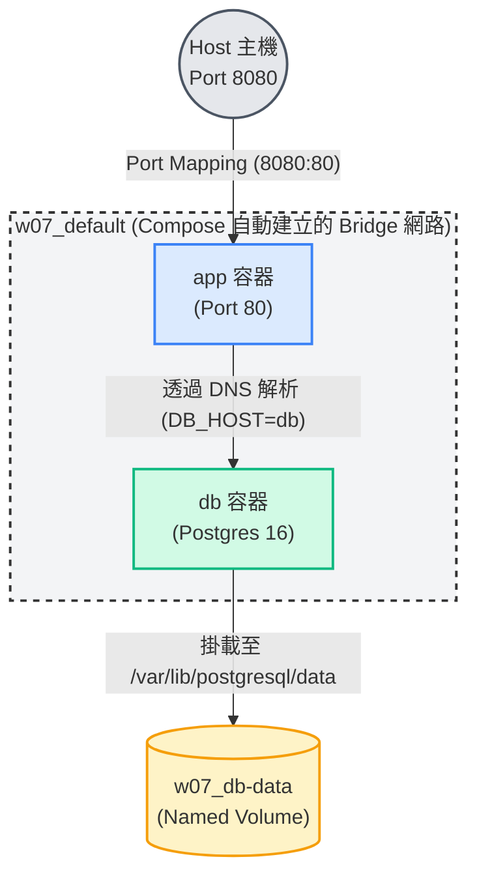

# W07｜Docker Compose 與資料持久化

## 拓樸圖

## 從 docker run 到 compose.yaml
**我最有感的一個改善是：**
不需要再手動記憶並輸入那一長串的網路創建、環境變數綁定和 Volume 掛載指令。Compose 把所有的設定變成一份「宣告式」的 YAML 檔案，這不僅讓整個架構一目瞭然，而且當我想要把專案交接給別人，或是重新部署時，只需要一句 `docker compose up -d` 就能完美重現整個系統。這解決了過去容易漏抄指令或打錯密碼的痛點。

## 三種掛載對照
| 掛載類型 | 路徑（host） | 容器砍重起資料還在嗎 | 重啟容器資料狀態 | 適合情境 |
|---|---|---|---|---|
| **named volume** | `/var/lib/docker/volumes/...` | 在 | 資料保留，完全不受影響 | 生產環境的資料庫儲存，需要 Docker 管理生命週期的資料 |
| **bind mount** | Host 機器上你指定的絕對或相對路徑 | 在 | 資料保留，完全同步 | 開發階段，需要即時修改原始碼並讓容器立刻生效 |
| **tmpfs** | Host 機器的記憶體 (RAM) 中 | **不在** | 資料消失，全部清空 | 儲存敏感的密鑰或需要極高讀寫速度的暫存資料 |

## healthcheck 前後對照
| 寫法 | curl /healthz t=1s | t=3s | t=5s | t=10s |
|---|---|---|---|---|
| 只 depends_on | 503 | 503 | 503 | 200 |
| service_healthy | refused | refused | 200 | 200 |

**觀察：**
當只有使用 `depends_on` 時，Compose 只要看到 db「啟動了」就會立刻啟動 app。但此時 Postgres 還在初始化，導致 app 連線失敗並回傳 `503`。
加入 `healthcheck` 搭配 `condition: service_healthy` 後，Compose 會耐心等待 db 的 healthcheck 回報成功（真正能接受連線）後才啟動 app。這時候 app 一旦啟動，就能立刻成功連線到資料庫，回傳 `200`，解決了時序上的競態條件 (Race condition)。

## healthcheck 前後對照
| 寫法 | curl /healthz t=1s | t=3s | t=5s | t=10s |
|---|---|---|---|---|
| 只 depends_on | 503 | 503 | 503 | 200 |
| service_healthy | refused | refused | 200 | 200 |

**觀察：**
當只有使用 `depends_on` 時，Compose 只要看到 db「啟動了」就會立刻啟動 app。但此時 Postgres 還在初始化，導致 app 連線失敗並回傳 `503`。
加入 `healthcheck` 搭配 `condition: service_healthy` 後，Compose 會耐心等待 db 的 healthcheck 回報成功（真正能接受連線）後才啟動 app。這時候 app 一旦啟動，就能立刻成功連線到資料庫，回傳 `200`，解決了時序上的競態條件 (Race condition)。

## 設計決策
**為什麼 db 用 named volume 而不是 bind mount？**
因為資料庫的檔案結構是由資料庫引擎（如 Postgres）自行管理的，我們不需要也不應該直接在 Host 端用編輯器去干涉這些二進位檔案。使用 named volume 可以將這些細節完全交給 Docker 管理，避免了 Bind Mount 常見的權限衝突（UID/GID 不對齊）與跨平台（Windows/Mac/Linux）效能問題。

**為什麼不能在生產用 tmpfs 存資料庫？**
因為 tmpfs 是建立在記憶體 (RAM) 中的。一旦容器停止、崩潰或主機重啟，記憶體斷電後所有測試或生產資料將會瞬間灰飛煙滅，這對於需要持久化保存資料的資料庫來說是絕對災難。