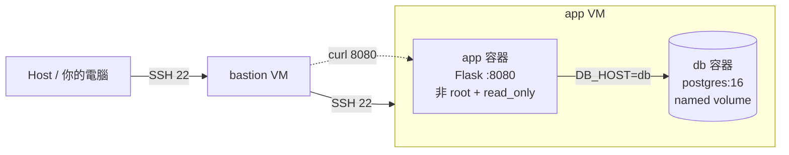
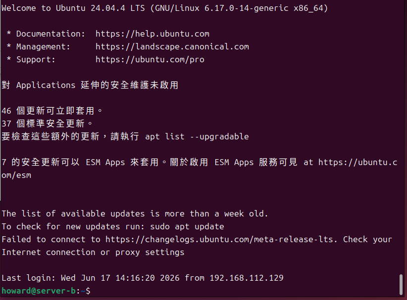
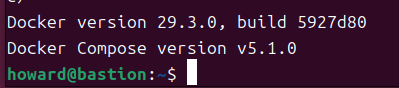
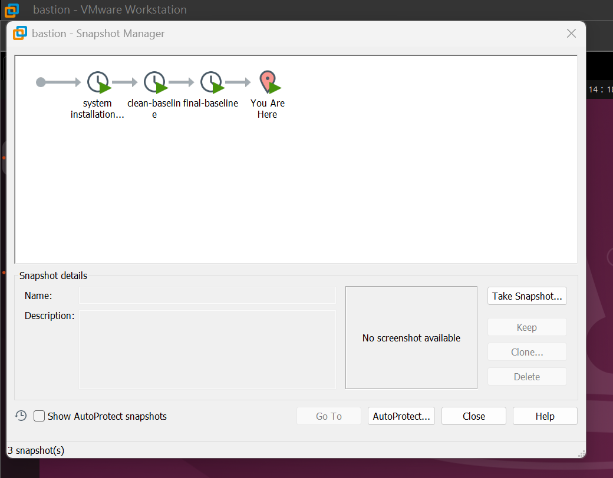
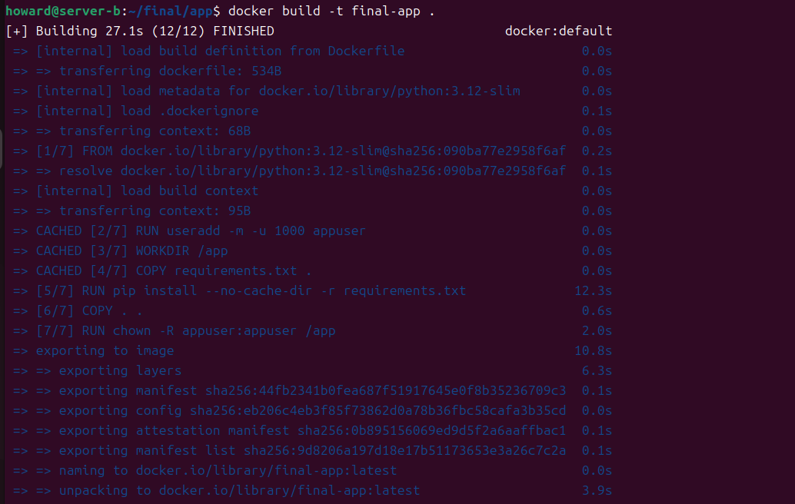
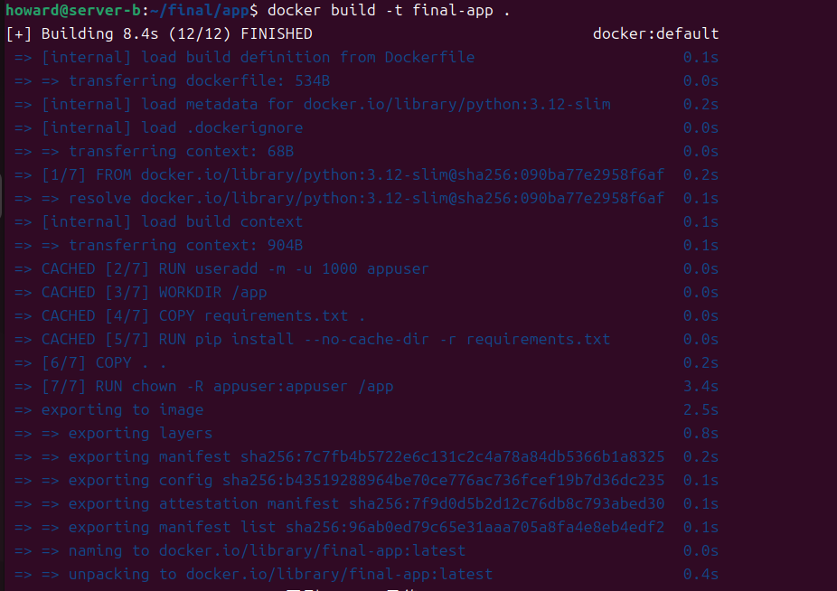
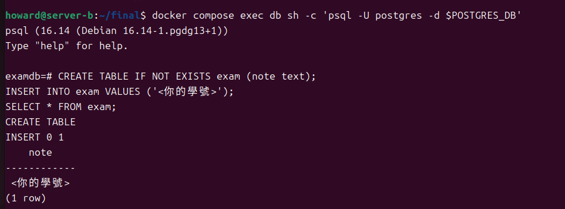
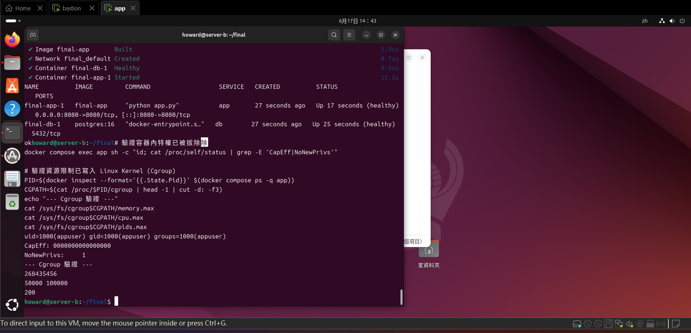

# 期末實作 — <學號> <姓名>

## 1. 架構總覽

這是一個具備生產環境規格的雙容器 Web 服務。透過 Bastion 主機作為跳板連線至 App 虛擬機。App 虛擬機上運行著以 Compose 管理的 Flask 應用程式 (App) 與 PostgreSQL 資料庫 (Db)。
App 容器實作了非 root、唯讀檔案系統與能力拔除 (cap_drop) 等安全防護，並透過 8080 port 提供服務；Db 容器則透過 Named Volume 確保資料持久化。兩者皆配置了資源上限與日誌輪轉，並由 Compose 負責確保資料庫健康後才啟動 App 服務。

## 2. Part A：底座與基準點




## 3. Part B：Dockerfile 與快取


### 為什麼聽 8080 不聽 80？
因為在後續的生產化加固 (Part D) 中，我們會將容器切換為非 root 使用者 (USER appuser) 運行，並透過 cap_drop: [ALL] 拔除所有特權。在 Linux 的安全模型中，非 root 使用者預設無法綁定 1024 以下的特權通訊埠 (Privileged Ports)。因此必須改為監聽 8080，再透過 Compose 的 port mapping 轉發。

## 4. Part C：Compose 與資料持久化
**三段對照實驗結果：**

- **砍容器重建 (`down` + `up`)**：查詢結果顯示資料依舊存在，因為資料庫的 named volume 未被刪除。
- **連 volume 一起砍 (`down -v` + `up`)**：再次查詢時出現 `ERROR: relation "exam" does not exist`，證明底層的儲存空間已被銷毀，資料徹底遺失。
- **重寫**：再次執行 INSERT 指令後，資料順利重新寫入並能被查詢出來。

### down vs down -v
`docker compose down` 僅會停止並刪除容器與網路，但會保留 Named Volume (如 db-data)，因此資料庫的資料不會遺失。而加上 `-v` 參數 (`docker compose down -v`) 則會連帶將 Compose 專案關聯的 Named Volume 一併刪除，導致持久化資料徹底被銷毀。Named Volume 的生命週期是由 Docker Daemon 獨立管理的，不會隨著容器的消滅而消失，除非人為使用 -v 或 docker volume rm 主動刪除。

## 5. Part D：生產化加固

```
NAME          IMAGE         COMMAND                   SERVICE   CREATED          STATUS                    PORTS
final-app-1   final-app     "python app.py"           app       27 seconds ago   Up 17 seconds (healthy)   0.0.0.0:8080->8080/tcp, [::]:8080->8080/tcp
final-db-1    postgres:16   "docker-entrypoint.s…"   db        27 seconds ago   Up 25 seconds (healthy)   5432/tcp
ok
howard@server-b:~/final# 驗證容器內特權已被拔除除
docker compose exec app sh -c "id; cat /proc/self/status | grep -E 'CapEff|NoNewPrivs'"

# 驗證資源限制已寫入 Linux Kernel (Cgroup)
PID=$(docker inspect --format='{{.State.Pid}}' $(docker compose ps -q app))
CGPATH=$(cat /proc/$PID/cgroup | head -1 | cut -d: -f3)
echo "--- Cgroup 驗證 ---"
cat /sys/fs/cgroup$CGPATH/memory.max
cat /sys/fs/cgroup$CGPATH/cpu.max
cat /sys/fs/cgroup$CGPATH/pids.max
uid=1000(appuser) gid=1000(appuser) groups=1000(appuser)
CapEff:	0000000000000000
NoNewPrivs:	1
--- Cgroup 驗證 ---
268435456
50000 100000
200
```
### yaml 的值怎麼對回 cgroup 檔案？
- `mem_limit: 256m` 轉換為 Byte 即為 268435456 (256 * 1024 * 1024)，對應 `/sys/fs/cgroup/.../memory.max`。
- `cpus: "0.5"` 代表每 100000 毫秒週期內分配 50000 毫秒的額度，對應 `/sys/fs/cgroup/.../cpu.max` 裡的 `50000 100000`。
- `pids_limit: 200` 直接對應 `/sys/fs/cgroup/.../pids.max` 的值 200，限制最大行程數。

## 6. Part E：故障演練
### 故障 1：F1 (停用 db 容器)
- 注入方式：`docker compose stop db`
- 故障前：`curl http://localhost:8080/healthz` 回傳 200 ok，兩容器皆 healthy。
- 故障中：app 容器狀態仍為 Up，但 healthcheck 轉為 unhealthy；`curl` 存取回傳 503 db unreachable。
- 回復後：執行 `docker compose start db`，數秒後雙雙恢復 healthy，回傳 200 ok。
- 診斷推論：此故障發生在「相依服務層」。app 容器本身仍正常運作（網路通暢、進程活著），但其依賴的後端資料庫斷線，導致應用程式內部的邏輯捕獲異常並主動回傳 HTTP 503 狀態碼。

### 故障 2：F2 (停用 app 容器)
- 注入方式：`docker compose stop app`
- 故障前：`curl http://localhost:8080/healthz` 回傳 200 ok。
- 故障中：執行 `curl http://localhost:8080` 立即遭遇 `connection refused`。
- 回復後：執行 `docker compose start app` 後恢復正常。
- 診斷推論：此故障發生在「容器/網路層」。因為 app 容器已經停止，Host 上沒有任何行程在監聽 8080 port，因此作業系統的網路協定疊 (TCP/IP stack) 在接收到 SYN 封包時，直接以 RST 封包拒絕連線 (connection refused)。

### 三症狀分層表（必答）
| 症狀 | 最可能的層 | 第一條驗證命令 |
| ---- | ---------- | -------------- |
| timeout | 防火牆 / 路由層 | `sudo ufw status` 檢查防火牆是否擋住，或 `ping` 檢查網路連通性 |
| connection refused | 容器層 / 系統網路層 | `docker compose ps` 檢查容器是否仍在運行，或 `ss -tlnp` 看 port 有無被監聽 |
| HTTP 503 | 應用邏輯層 / 後端服務層 | `docker compose logs app` 查看應用程式是否印出資料庫連線失敗等錯誤 |

## 7. 反思（200 字）
<請寫下你對於 VM、namespace、cgroup、權限階梯四者「隔離」概念的體悟。>