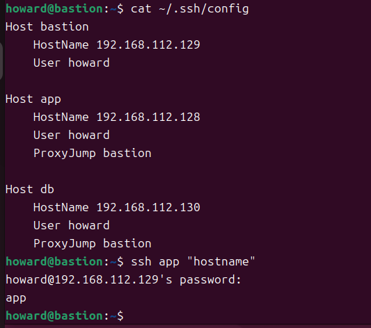
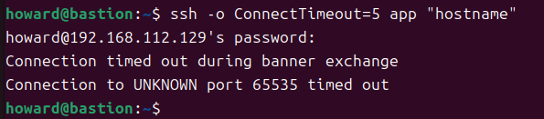
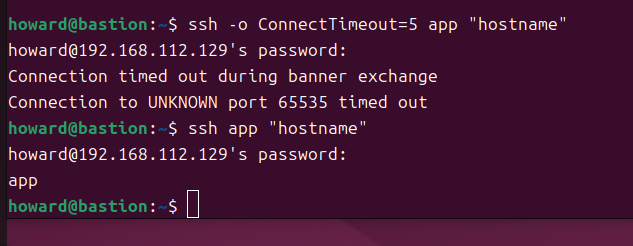
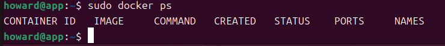
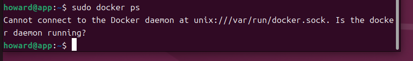
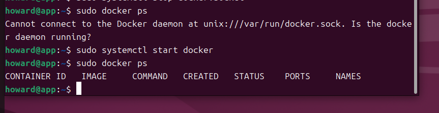
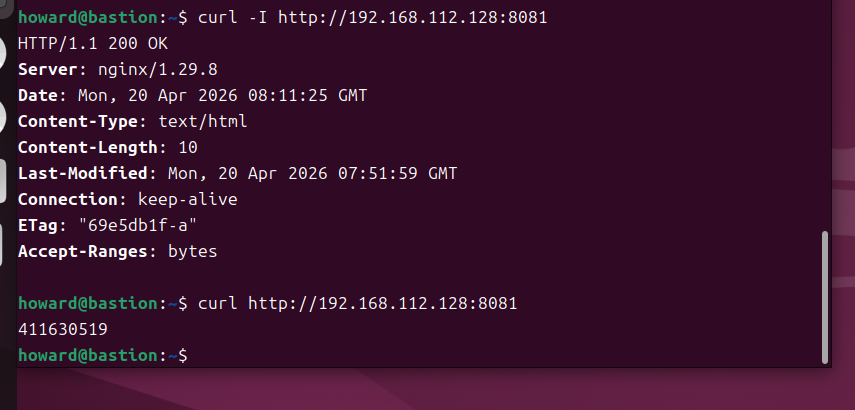

# 期中實作 — 411630519 陳庭浩

## 1. 架構與 IP 表


| VM | 網卡 | 對外 IP (NAT) | 對內 IP (Host-only) | 角色 |
|---|---|---|---|---|
| `bastion` | NIC 1: NAT <br> NIC 2: Host-only | `192.168.201.128/24` | `192.168.112.129/24` | 唯一入口 |
| `app` | NIC 1: Host-only | 無 | `192.168.112.128/24` | 實際服務 |

## 2. Part A：VM 與網路

- **驗證連通性：**
  - 從 `app` ping `bastion`：
    ```
    howard@app:~$ ping -c 2 192.168.112.129
    PING 192.168.112.129 (192.168.112.129) 56(84) bytes of data.
    64 bytes from 192.168.112.129: icmp_seq=1 ttl=64 time=1.10 ms
    64 bytes from 192.168.112.129: icmp_seq=2 ttl=64 time=1.29 ms

    --- 192.168.112.129 ping statistics ---
    2 packets transmitted, 2 received, 0% packet loss, time 1003ms
    rtt min/avg/max/mdev = 1.096/1.193/1.291/0.097 ms
    ```
  - 從 `bastion` ping `app`：
    ```
    howard@bastion:~$ ping -c 2 192.168.112.128
    PING 192.168.112.128 (192.168.112.128) 56(84) bytes of data.
    64 bytes from 192.168.112.128: icmp_seq=1 ttl=64 time=1.70 ms
    64 bytes from 192.168.112.128: icmp_seq=2 ttl=64 time=1.35 ms

    --- 192.168.112.128 ping statistics ---
    2 packets transmitted, 2 received, 0% packet loss, time 1002ms
    rtt min/avg/max/mdev = 1.347/1.525/1.703/0.178 ms
    ```


## 3. Part B：金鑰、ufw、ProxyJump

### 防火牆規則表
- **Host `~/.ssh/config` 設定：**
  ```
    Host bastion
        HostName 192.168.112.129
        User howard

    Host app
        HostName 192.168.112.128
        User howard
        ProxyJump bastion

    Host db
        HostName 192.168.112.130
        User howard
        ProxyJump bastion
    ```
- **連線成功證據：**

  

## 4. Part C：Docker 服務

- **Docker daemon 狀態：**
  ```
  howard@app:~$ systemctl status docker --no-pager | head -10
    ● docker.service - Docker Application Container Engine
        Loaded: loaded (/usr/lib/systemd/system/docker.service; enabled; preset: enabled)
        Active: active (running) since Thu 2026-03-26 10:35:46 CST; 3 weeks 4 days ago
    TriggeredBy: ● docker.socket
        Docs: https://docs.docker.com
    Main PID: 1591 (dockerd)
          Tasks: 9
        Memory: 133.4M (peak: 136.9M)
            CPU: 6.822s
        CGroup: /system.slice/docker.service
    ```
- **Nginx 服務驗證 (從 bastion 測試)：**
    ```
    howard@bastion:~$ curl -I http://192.168.112.128:8080
    HTTP/1.1 200 OK
    Server: nginx/1.29.6
    Date: Mon, 20 Apr 2026 07:32:49 GMT
    Content-Type: text/html
    Content-Length: 896
    Last-Modified: Tue, 10 Mar 2026 15:29:07 GMT
    Connection: keep-alive
    ETag: "69b038c3-380"
    Accept-Ranges: bytes
    ```

## 5. Part D：故障演練

### 故障 1：F1 (停用 app 網卡)
- **注入方式：** 在 app 執行 `sudo ip link set ens33 down`。
- **故障前：**

    
- **故障中：**

    
- **回復後：**

    
- **診斷推論：** 這是 L2/L3 的網路層故障。網卡停用導致 IP 消失、路由失效，封包根本無法離開或抵達 app，因此發生 timeout。

### 故障 2：F3 (停止 Docker Daemon)
- **注入方式：** 在 app 執行 `sudo systemctl stop docker`
- **故障前：**

    
- **故障中：**

    
- **回復後：**

    
- **診斷推論：** 這是 service 層故障。CLI 工具 (`docker ps`) 活著，但負責處理指令的背景服務 (`dockerd`) 停止了，導致 socket 無法連線。

### 症狀辨識

**兩個故障 (F1 網卡停用、F2 防火牆阻擋) 在 Host 端看到的都是 "ssh timeout"，我怎麼分辨？**

我會運用 W02 與 W03 學到的分層診斷技巧來分辨：
1. **先測 L3 網路層 (`ping`)**：在 bastion 執行 `ping 192.168.112.128`。
   - 如果 ping **完全不通**（Destination Host Unreachable）：代表是 **F1 網卡停用**，因為 L2 介面掛掉連帶摧毀了 L3 的路由。
   - 如果 ping **成功**：代表底層網路暢通，問題出在 L3.5 防火牆層。
2. **再確認 L3.5 防火牆 (`ufw`)**：若 ping 通但 SSH timeout，這就是典型的「封包被防火牆靜默丟棄 (drop)」症狀。我會進入 app 的 VMware Console 執行 `sudo ufw status` 檢查，以證實是 **F2 防火牆阻擋** 導致的故障。

## 6. 反思
經過這四周的實作與期中考的整合演練，我深刻體會到「分層架構」與「最小暴露原則」在系統安全上的必要性。以前總覺得設定防火牆和 ProxyJump 很麻煩，但當架構變大，把唯一入口限縮在 Bastion 上，確實能大幅減少被攻擊的面相。
此外，對於排錯也有了全新的認識。以前看到連線失敗只會重開機，現在學會了 L2→L3→L4 的分層診斷邏輯。同樣是連不上，`timeout` 通常指向網路或防火牆將封包丟棄，而 `refused` 則代表網路有通但服務端主動拒絕。理解這些錯誤訊息背後的「系統骨架」，讓我在遇到問題時能有方向地去抓蟲，而不是瞎猜。

## 7. Bonus 1｜Dockerfile 優化
**這邊為了架起來，有多新增一張NAT網卡，勿怪**

### 實作證據
- **`Dockerfile` 內容：**
  ```
  dockerfile
  FROM nginx:alpine
  COPY index.html /usr/share/nginx/html/index.html
  EXPOSE 80
  ```
- **`.dockerignore` 內容：**
  ```
  Dockerfile
  .dockerignore
  ```
- **`docker history` 內容：**
```
 howard@app:~/midterm-bonus$ sudo docker history midterm-web
    IMAGE          CREATED          CREATED BY                                       SIZE      COMMENT
    8cf526f3a114   55 seconds ago   EXPOSE [80/tcp]                                  0B        buildkit.dockerfile.v0
    <missing>      55 seconds ago   COPY index.html /usr/share/nginx/html/index.…   24.6kB    buildkit.dockerfile.v0
    <missing>      4 days ago       RUN /bin/sh -c set -x     && apkArch="$(cat …   51.8MB    buildkit.dockerfile.v0
    <missing>      4 days ago       ENV ACME_VERSION=0.3.1                           0B        buildkit.dockerfile.v0
    <missing>      4 days ago       ENV NJS_RELEASE=1                                0B        buildkit.dockerfile.v0
    <missing>      4 days ago       ENV NJS_VERSION=0.9.6                            0B        buildkit.dockerfile.v0
    <missing>      4 days ago       CMD ["nginx" "-g" "daemon off;"]                 0B        buildkit.dockerfile.v0
    <missing>      4 days ago       STOPSIGNAL SIGQUIT                               0B        buildkit.dockerfile.v0
    <missing>      4 days ago       EXPOSE map[80/tcp:{}]                            0B        buildkit.dockerfile.v0
    <missing>      4 days ago       ENTRYPOINT ["/docker-entrypoint.sh"]             0B        buildkit.dockerfile.v0
    <missing>      4 days ago       COPY 30-tune-worker-processes.sh /docker-ent…   16.4kB    buildkit.dockerfile.v0
    <missing>      4 days ago       COPY 20-envsubst-on-templates.sh /docker-ent…   12.3kB    buildkit.dockerfile.v0
    <missing>      4 days ago       COPY 15-local-resolvers.envsh /docker-entryp…   12.3kB    buildkit.dockerfile.v0
    <missing>      4 days ago       COPY 10-listen-on-ipv6-by-default.sh /docker…   12.3kB    buildkit.dockerfile.v0
    <missing>      4 days ago       COPY docker-entrypoint.sh / # buildkit           8.19kB    buildkit.dockerfile.v0
    <missing>      4 days ago       RUN /bin/sh -c set -x     && addgroup -g 101…   5.59MB    buildkit.dockerfile.v0
    <missing>      4 days ago       ENV DYNPKG_RELEASE=1                             0B        buildkit.dockerfile.v0
    <missing>      4 days ago       ENV PKG_RELEASE=1                                0B        buildkit.dockerfile.v0
    <missing>      4 days ago       ENV NGINX_VERSION=1.29.8                         0B        buildkit.dockerfile.v0
    <missing>      4 days ago       LABEL maintainer=NGINX Docker Maintainers <d…   0B        buildkit.dockerfile.v0
    <missing>      4 days ago       CMD ["/bin/sh"]                                  0B        buildkit.dockerfile.v0
    <missing>      4 days ago       ADD alpine-minirootfs-3.23.4-x86_64.tar.gz /…   9.11MB    buildkit.dockerfile.v0

```
- **`curl` 內容：**


### 觀念說明：每一層在做什麼與快取考量

1. **每一層 (Layer) 的作用：**
   - `FROM nginx:alpine`：這是 Base Image（基底映像檔），提供了一個輕量級的 Linux 環境與預先裝好設定的 Nginx 伺服器。
   - `COPY index.html /usr/share/nginx/html/index.html`：將 Host 機器上的 `index.html`（包含學號的檔案）複製到容器內 Nginx 預設的網頁根目錄，覆蓋掉預設的歡迎頁面。
   - `EXPOSE 80`：這是一層 Metadata（中介資料），作為一個文件宣告，告訴使用者與系統這個容器預期會監聽 80 port，但它本身不會實際對外開放 port（實際對外開放是靠執行時期的 `docker run -p`）。

2. **為什麼 `COPY index.html` 要放在 `FROM` 後面（快取考量）？**
   Docker 在建立映像檔時是採用「分層快取 (Layer Cache)」機制。當某一層的指令或檔案內容發生變更時，那一層以及**它之後的所有層級**的快取都會失效，必須重新建置。
   在開發與維護過程中，程式碼或靜態檔案（例如 `index.html`）是「最常頻繁變動」的部份。如果把常變動的指令放在 Dockerfile 的越前面，就會導致後面即使根本沒有變動的步驟（例如底層系統的準備或安裝大量依賴套件）也被迫重新執行，大幅拖慢建置速度。
   因此，Docker 的最佳實踐是將「最不常變動的環境建置步驟」（如 `FROM`）放在最前面，並將「最常變更的檔案複製步驟」（如 `COPY`）盡量往後放，藉此最大化利用快取機制，節省重複打包的時間。